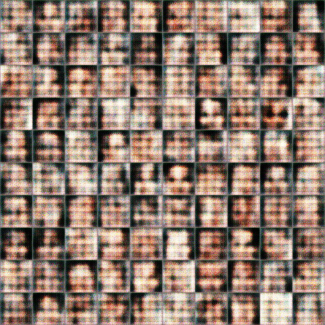
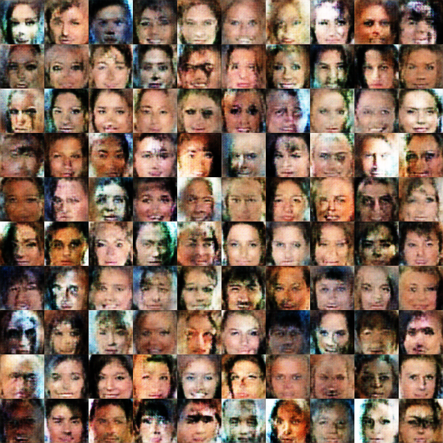
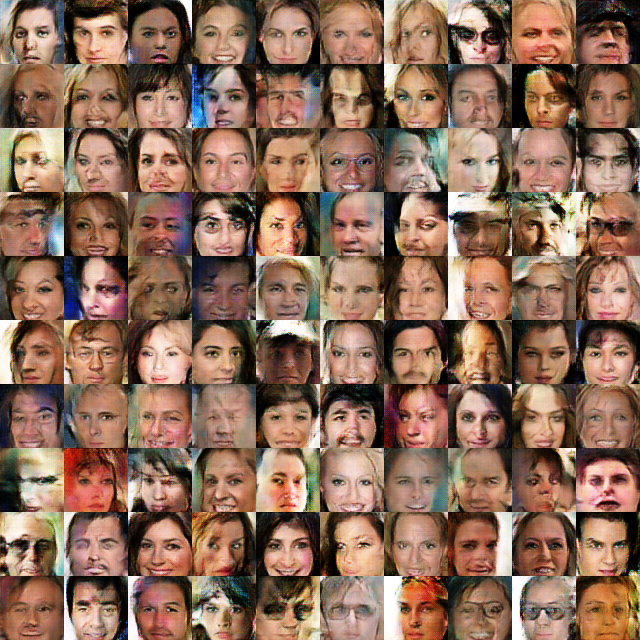

# TF2-WGAN


## Usage

- Requirements
    - [Numpy](http://www.numpy.org/)
    - [TensorFlow >= 2.0](https://www.tensorflow.org/versions/r2.0/api_docs/python/tf)
    - [TensorFlow Datasets](https://www.tensorflow.org/datasets/)

- Training WGAN-GP
    ```bash
    python main.py
    ```

- TensorBoard
    ```bash
    tensorboard --logdir logs_wgan
    ```

## Results
1. 100 Iteratives


2. 1000 Iteratives


3. 15800 Iteratives



TensorBoard Output


## References
1. [Improved Training of Wasserstein GANs](https://arxiv.org/abs/1704.00028)
2. [DCGAN-LSGAN-WGAN-GP-DRAGAN-Tensorflow-2](https://github.com/LynnHo/DCGAN-LSGAN-WGAN-GP-DRAGAN-Tensorflow-2)